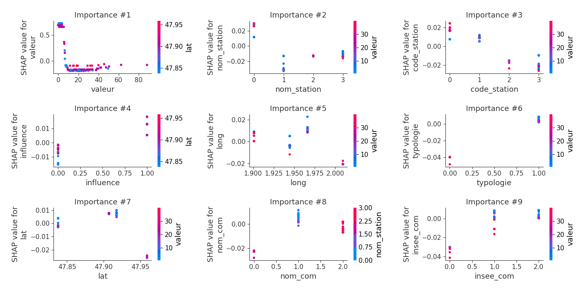
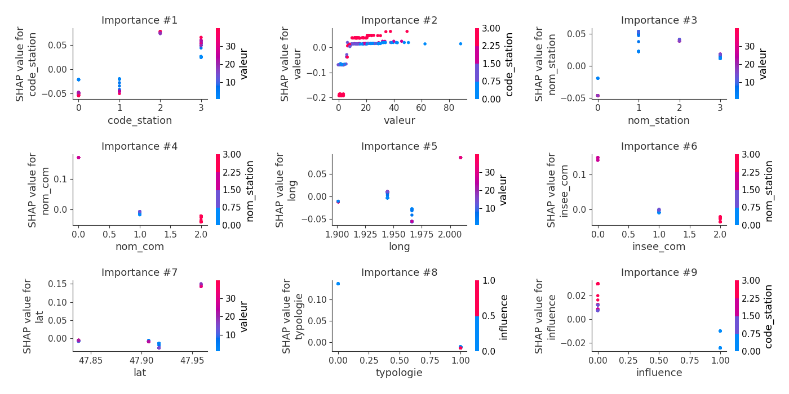
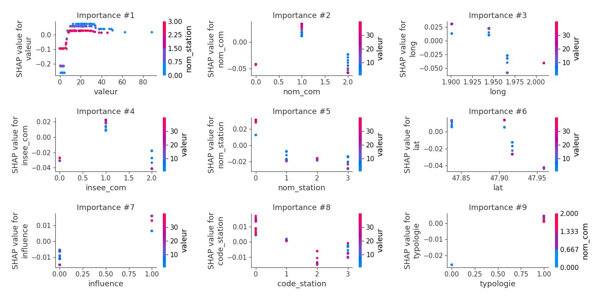
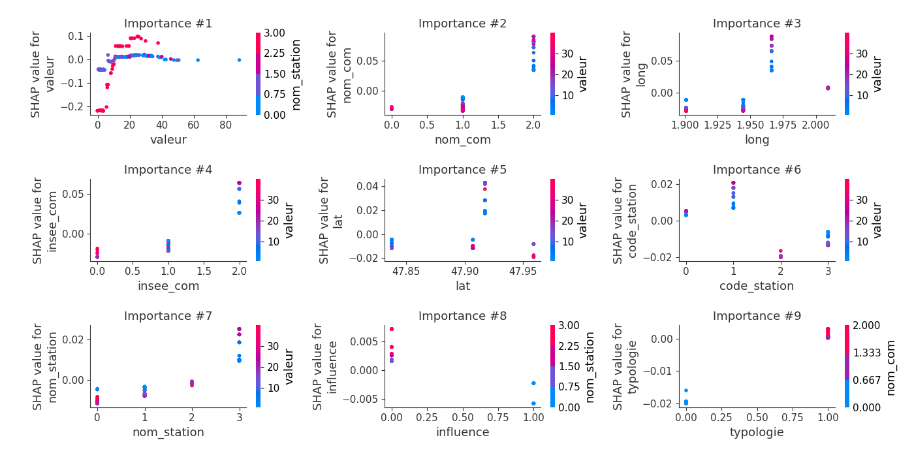
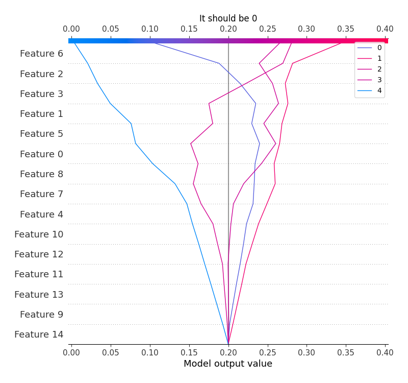
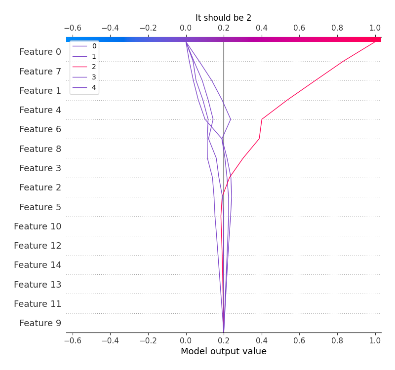

# Summary of 6_Default_RandomForest

[<< Go back](../README.md)

## Random Forest
- **criterion**: gini
- **max_features**: 0.9
- **min_samples_split**: 30
- **max_depth**: 4
- **num_class**: 5
- **explain_level**: 2

## Validation
 - **validation_type**: split
 - **train_ratio**: 0.75
 - **shuffle**: True
 - **stratify**: True

## Optimized metric
logloss

## Training time

9.9 seconds

### Metric details
|           |         0 |         1 |         2 |         3 |         4 |   accuracy |   macro avg |   weighted avg |   logloss |
|:----------|----------:|----------:|----------:|----------:|----------:|-----------:|------------:|---------------:|----------:|
| precision |  0.878049 |  0.3875   |  0.9375   |  0.392857 |  0.5      |       0.56 |    0.619181 |       0.621074 |  0.860851 |
| recall    |  0.765957 |  0.62     |  0.517241 |  0.323529 |  0.333333 |       0.56 |    0.512012 |       0.56     |  0.860851 |
| f1-score  |  0.818182 |  0.476923 |  0.666667 |  0.354839 |  0.4      |       0.56 |    0.543322 |       0.569706 |  0.860851 |
| support   | 47        | 50        | 29        | 34        | 15        |       0.56 |  175        |     175        |  0.860851 |

## Confusion matrix
|              |   Predicted as 0 |   Predicted as 1 |   Predicted as 2 |   Predicted as 3 |   Predicted as 4 |
|:-------------|-----------------:|-----------------:|-----------------:|-----------------:|-----------------:|
| Labeled as 0 |               36 |                5 |                0 |                6 |                0 |
| Labeled as 1 |                2 |               31 |                1 |               11 |                5 |
| Labeled as 2 |                1 |               13 |               15 |                0 |                0 |
| Labeled as 3 |                1 |               22 |                0 |               11 |                0 |
| Labeled as 4 |                1 |                9 |                0 |                0 |                5 |

## Learning curves

## Permutation-based Importance

## SHAP Importance

## SHAP Dependence plots

### Dependence 0 (Fold 1)

### Dependence 1 (Fold 1)

### Dependence 2 (Fold 1)

### Dependence 3 (Fold 1)

### Dependence 4 (Fold 1)

## SHAP Decision plots

### Worst decisions for selected sample 1 (Fold 1)

### Worst decisions for selected sample 2 (Fold 1)

### Worst decisions for selected sample 3 (Fold 1)

### Worst decisions for selected sample 4 (Fold 1)

### Best decisions for selected sample 1 (Fold 1)

### Best decisions for selected sample 2 (Fold 1)

### Best decisions for selected sample 3 (Fold 1)

### Best decisions for selected sample 4 (Fold 1)

[<< Go back](../README.md)
