# Exploratory Data Analysis

[<< Go back](../README.md)
## Feature : target
- **Feature type** : discrete
- **Missing** : 0.0%
- **Unique** : 5
- **Count** :698.0
- **Mean** :1.5530085959885387
- **Std** :1.3047417561116113
- **Min** :0.0
- **25%th Percentile** : 0.0
- **50%th Percentile** : 1.0
- **75%th Percentile** : 3.0
- **Max** :4.0

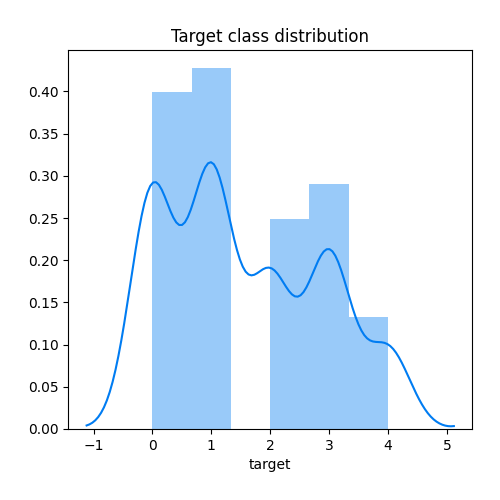
## Feature : nom_com
- **Feature type** : discrete
- **Missing** : 0.0%
- **Unique** : 3
- **Count** :698.0
- **Mean** :1.186246418338109
- **Std** :0.5564129397883472
- **Min** :0.0
- **25%th Percentile** : 1.0
- **50%th Percentile** : 1.0
- **75%th Percentile** : 2.0
- **Max** :2.0

## Feature : insee_com
- **Feature type** : discrete
- **Missing** : 0.0%
- **Unique** : 3
- **Count** :698.0
- **Mean** :1.186246418338109
- **Std** :0.5564129397883472
- **Min** :0.0
- **25%th Percentile** : 1.0
- **50%th Percentile** : 1.0
- **75%th Percentile** : 2.0
- **Max** :2.0

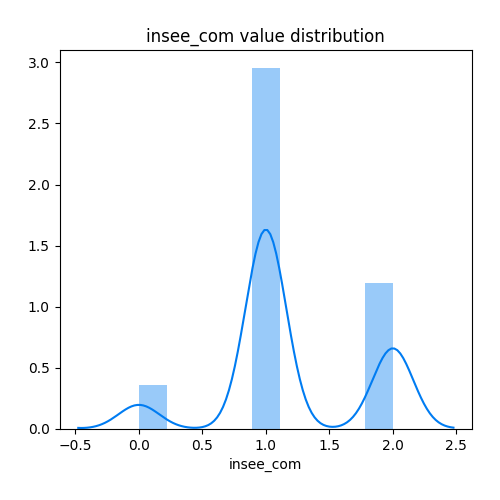
## Feature : nom_station
- **Feature type** : discrete
- **Missing** : 0.0%
- **Unique** : 4
- **Count** :698.0
- **Mean** :1.310888252148997
- **Std** :1.158548323139669
- **Min** :0.0
- **25%th Percentile** : 0.0
- **50%th Percentile** : 1.0
- **75%th Percentile** : 3.0
- **Max** :3.0

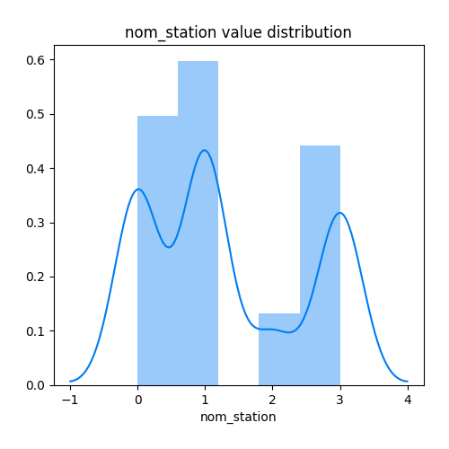
## Feature : code_station
- **Feature type** : discrete
- **Missing** : 0.0%
- **Unique** : 4
- **Count** :698.0
- **Mean** :1.497134670487106
- **Std** :1.250821405492228
- **Min** :0.0
- **25%th Percentile** : 0.0
- **50%th Percentile** : 1.0
- **75%th Percentile** : 3.0
- **Max** :3.0

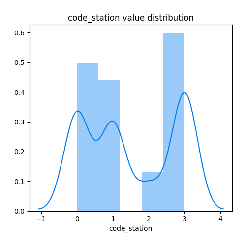
## Feature : typologie
- **Feature type** : discrete
- **Missing** : 0.0%
- **Unique** : 2
- **Count** :698.0
- **Mean** :0.9212034383954155
- **Std** :0.2696141807715164
- **Min** :0.0
- **25%th Percentile** : 1.0
- **50%th Percentile** : 1.0
- **75%th Percentile** : 1.0
- **Max** :1.0

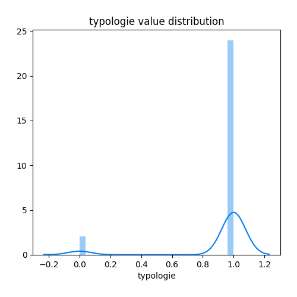
## Feature : influence
- **Feature type** : discrete
- **Missing** : 0.0%
- **Unique** : 2
- **Count** :698.0
- **Mean** :0.2979942693409742
- **Std** :0.4577049477473053
- **Min** :0.0
- **25%th Percentile** : 0.0
- **50%th Percentile** : 0.0
- **75%th Percentile** : 1.0
- **Max** :1.0

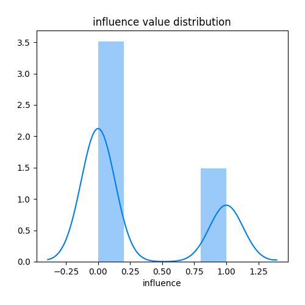
## Feature : valeur
- **Feature type** : continous
- **Missing** : 0.0%
- **Unique** : 360
- **Count** :698.0
- **Mean** :19.8445558739255
- **Std** :18.62218267763162
- **Min** :-0.3
- **25%th Percentile** : 8.9
- **50%th Percentile** : 17.9
- **75%th Percentile** : 26.75
- **Max** :239.7

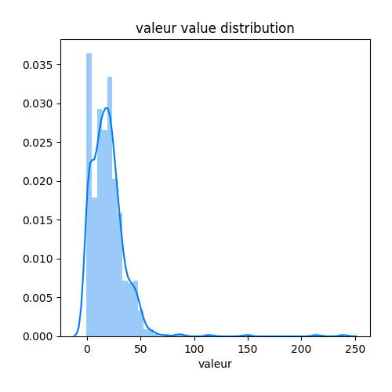
## Feature : lat
- **Feature type** : continous
- **Missing** : 0.0%
- **Unique** : 4
- **Count** :698.0
- **Mean** :47.88907448710602
- **Std** :0.04048902443172184
- **Min** :47.837765
- **25%th Percentile** : 47.837765
- **50%th Percentile** : 47.907074
- **75%th Percentile** : 47.917394
- **Max** :47.958972

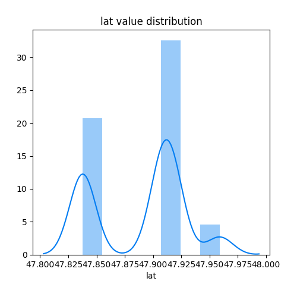
## Feature : long
- **Feature type** : continous
- **Missing** : 0.0%
- **Unique** : 4
- **Count** :698.0
- **Mean** :1.9425061848137537
- **Std** :0.03184233893328159
- **Min** :1.901139
- **25%th Percentile** : 1.901139
- **50%th Percentile** : 1.944658
- **75%th Percentile** : 1.966255
- **Max** :2.009286

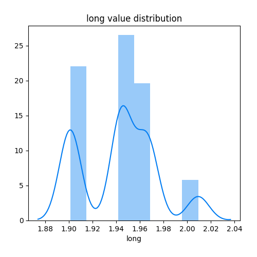
## Feature : jour_semaine_debut
- **Feature type** : discrete
- **Missing** : 0.0%
- **Unique** : 5
- **Count** :698.0
- **Mean** :4.240687679083095
- **Std** :1.0575712341153092
- **Min** :2.0
- **25%th Percentile** : 3.0
- **50%th Percentile** : 4.0
- **75%th Percentile** : 5.0
- **Max** :6.0

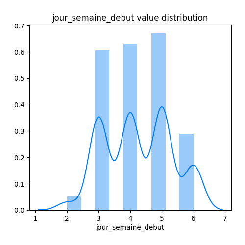
## Feature : jour_semaine_fin
- **Feature type** : discrete
- **Missing** : 0.0%
- **Unique** : 5
- **Count** :698.0
- **Mean** :4.240687679083095
- **Std** :1.0575712341153092
- **Min** :2.0
- **25%th Percentile** : 3.0
- **50%th Percentile** : 4.0
- **75%th Percentile** : 5.0
- **Max** :6.0

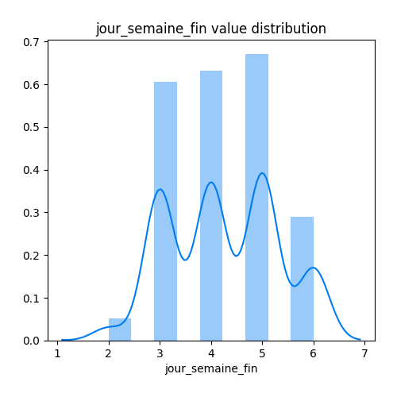
## Feature : jour_debut
- **Feature type** : discrete
- **Missing** : 0.0%
- **Unique** : 5
- **Count** :698.0
- **Mean** :8.240687679083095
- **Std** :1.0575712341153092
- **Min** :6.0
- **25%th Percentile** : 7.0
- **50%th Percentile** : 8.0
- **75%th Percentile** : 9.0
- **Max** :10.0

## Feature : jour_fin
- **Feature type** : discrete
- **Missing** : 0.0%
- **Unique** : 5
- **Count** :698.0
- **Mean** :8.240687679083095
- **Std** :1.0575712341153092
- **Min** :6.0
- **25%th Percentile** : 7.0
- **50%th Percentile** : 8.0
- **75%th Percentile** : 9.0
- **Max** :10.0

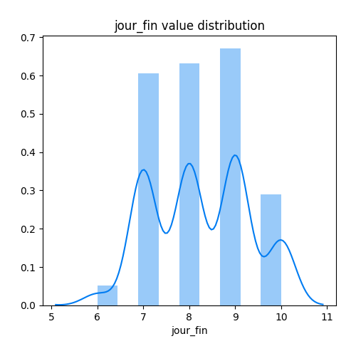
## Feature : heure_debut
- **Feature type** : discrete
- **Missing** : 0.0%
- **Unique** : 24
- **Count** :698.0
- **Mean** :10.892550143266476
- **Std** :7.102138750832458
- **Min** :0.0
- **25%th Percentile** : 5.0
- **50%th Percentile** : 10.0
- **75%th Percentile** : 17.0
- **Max** :23.0

## Feature : heure_fin
- **Feature type** : discrete
- **Missing** : 0.0%
- **Unique** : 24
- **Count** :698.0
- **Mean** :10.892550143266476
- **Std** :7.102138750832458
- **Min** :0.0
- **25%th Percentile** : 5.0
- **50%th Percentile** : 10.0
- **75%th Percentile** : 17.0
- **Max** :23.0

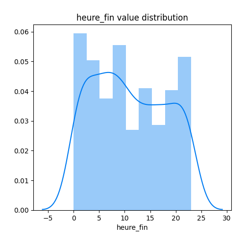
## Feature : minute_debut
- **Feature type** : discrete
- **Missing** : 0.0%
- **Unique** : 1
- **Count** :698.0
- **Mean** :0.0
- **Std** :0.0
- **Min** :0.0
- **25%th Percentile** : 0.0
- **50%th Percentile** : 0.0
- **75%th Percentile** : 0.0
- **Max** :0.0

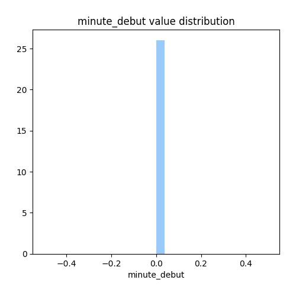
## Feature : minute_fin
- **Feature type** : discrete
- **Missing** : 0.0%
- **Unique** : 1
- **Count** :698.0
- **Mean** :59.0
- **Std** :0.0
- **Min** :59.0
- **25%th Percentile** : 59.0
- **50%th Percentile** : 59.0
- **75%th Percentile** : 59.0
- **Max** :59.0

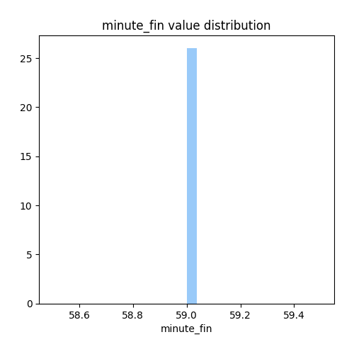

[<< Go back](../README.md)
