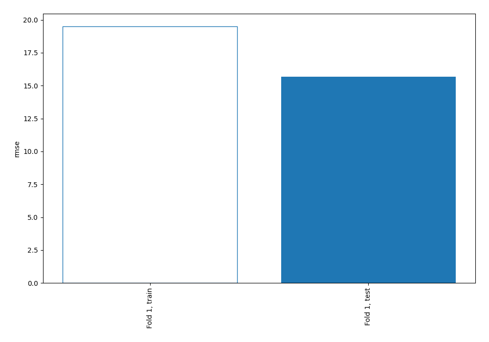

# Summary of 1_Baseline

[<< Go back](../README.md)

## Baseline Regressor (Baseline)
- **explain_level**: 2

## Validation
 - **validation_type**: split
 - **train_ratio**: 0.75
 - **shuffle**: True

## Optimized metric
rmse

## Training time

0.0 seconds

### Metric details:
| Metric   |      Score |
|:---------|-----------:|
| MAE      |  11.7751   |
| MSE      | 245.896    |
| RMSE     |  15.6811   |
| R2       |  -0.024159 |

## Learning curves

[<< Go back](../README.md)
