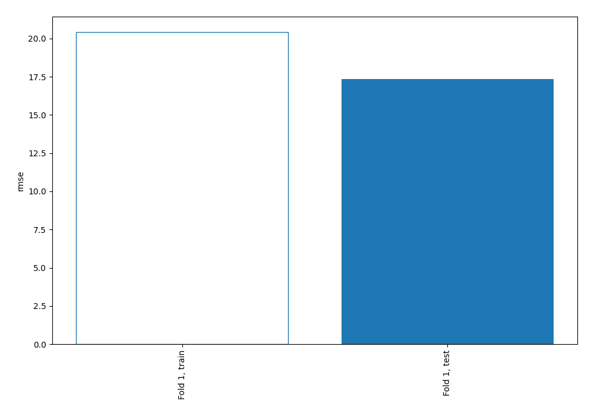
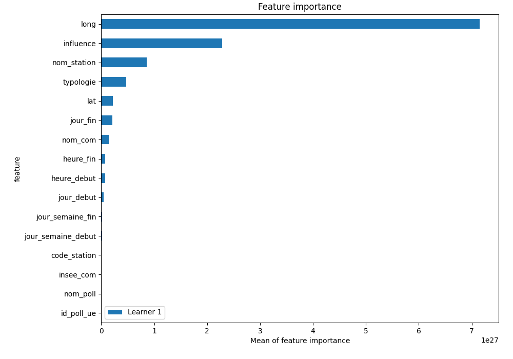
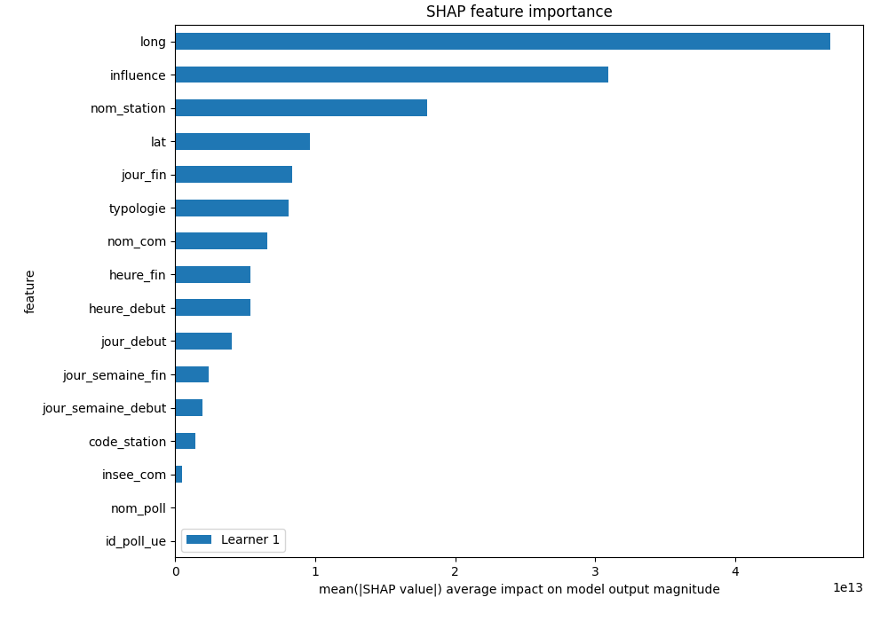
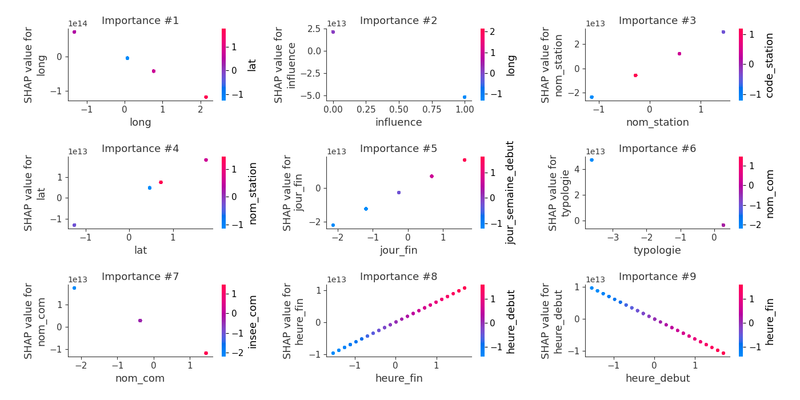
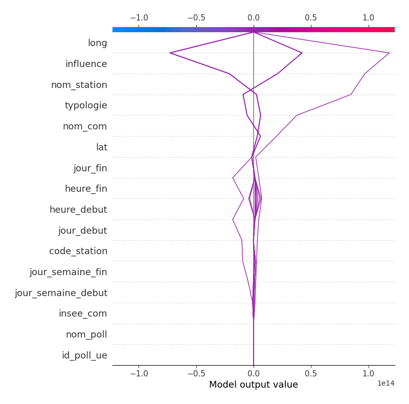
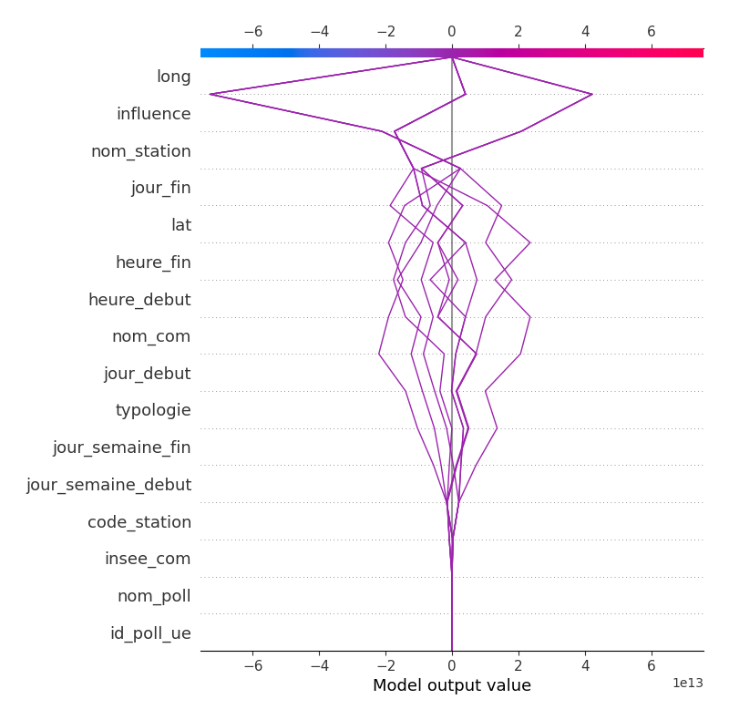

# Summary of 3_Linear

[<< Go back](../README.md)

## Linear Regression (Linear)
- **explain_level**: 2

## Validation
 - **validation_type**: split
 - **train_ratio**: 0.75
 - **shuffle**: True

## Optimized metric
rmse

## Training time

2.0 seconds

### Metric details:
| Metric   |     Score |
|:---------|----------:|
| MAE      |  11.9496  |
| MSE      | 300.47    |
| RMSE     |  17.3341  |
| R2       |  -0.25146 |

## Learning curves

## Coefficients
| feature            |    Learner_1 |
|:-------------------|-------------:|
| intercept          |  2.13862e+13 |
| nom_station        |  2.07688e+13 |
| jour_fin           |  1.04015e+13 |
| lat                |  1.03289e+13 |
| heure_fin          |  6.27464e+12 |
| code_station       |  1.53586e+12 |
| nom_poll           |  0.433811    |
| id_poll_ue         | -0.181641    |
| insee_com          | -5.64701e+11 |
| jour_semaine_debut | -2.42602e+12 |
| jour_semaine_fin   | -2.9937e+12  |
| jour_debut         | -4.98178e+12 |
| heure_debut        | -6.27464e+12 |
| nom_com            | -8.02216e+12 |
| typologie          | -1.30198e+13 |
| long               | -5.50569e+13 |
| influence          | -7.31046e+13 |

## Permutation-based Importance

## SHAP Importance

## SHAP Dependence plots

### Dependence (Fold 1)

## SHAP Decision plots

### Top-10 Worst decisions (Fold 1)

### Top-10 Best decisions (Fold 1)

[<< Go back](../README.md)
