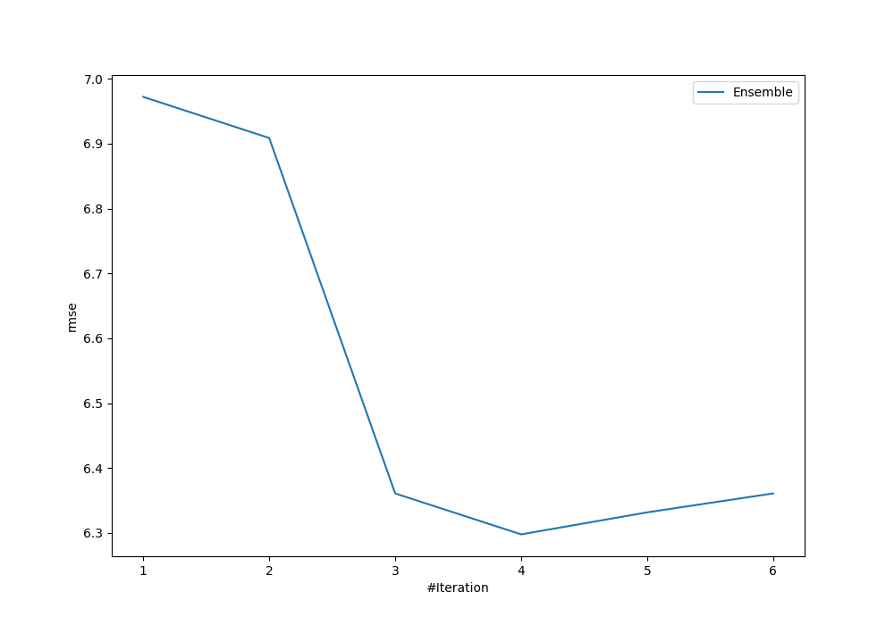

# Summary of Ensemble

[<< Go back](../README.md)

## Ensemble structure
| Model                   |   Weight |
|:------------------------|---------:|
| 4_Default_Xgboost       |        3 |
| 5_Default_NeuralNetwork |        1 |

### Metric details:
| Metric   |     Score |
|:---------|----------:|
| MAE      |  4.36861  |
| MSE      | 39.6632   |
| RMSE     |  6.29788  |
| R2       |  0.834802 |

## Learning curves

[<< Go back](../README.md)
