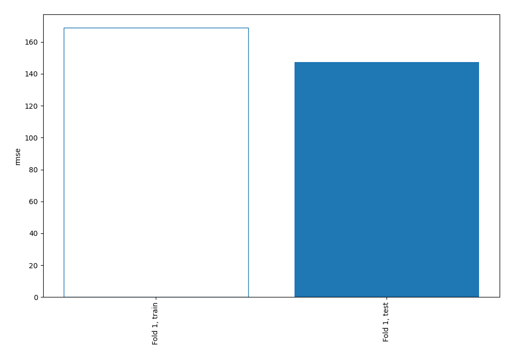

# Summary of 1_Baseline

[<< Go back](../README.md)

## Baseline Regressor (Baseline)
- **explain_level**: 2

## Validation
 - **validation_type**: split
 - **train_ratio**: 0.75
 - **shuffle**: True

## Optimized metric
rmse

## Training time

0.2 seconds

### Metric details:
| Metric   |           Score |
|:---------|----------------:|
| MAE      |    47.7755      |
| MSE      | 21711.9         |
| RMSE     |   147.349       |
| R2       |    -2.35392e-05 |

## Learning curves

[<< Go back](../README.md)
