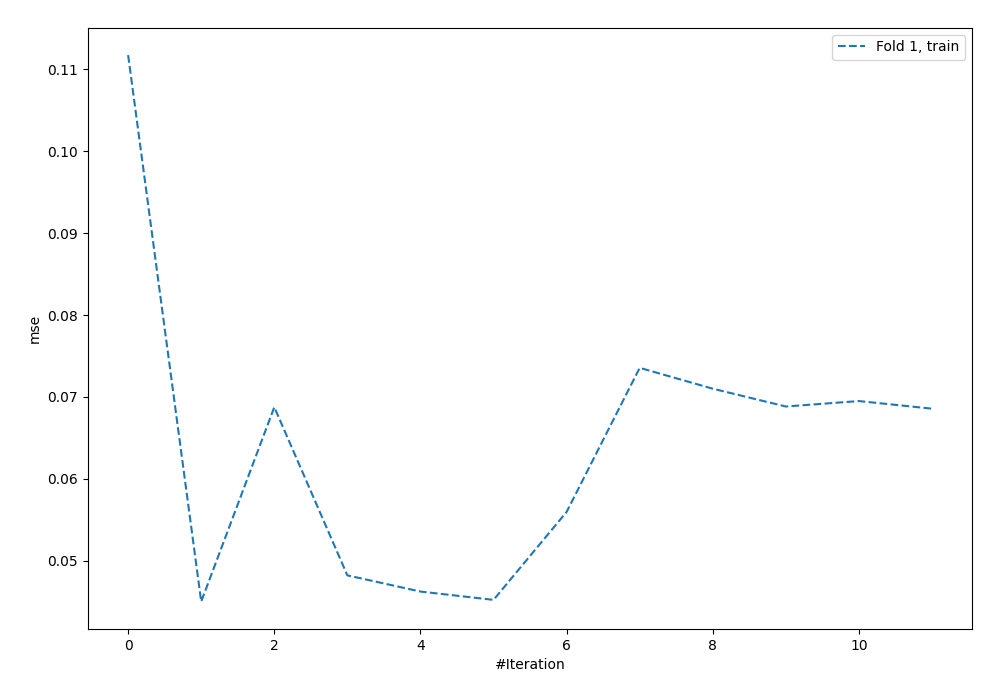
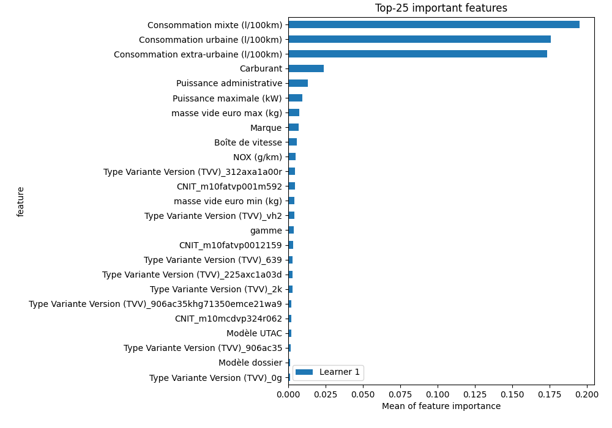

# Summary of 5_Default_NeuralNetwork

[<< Go back](../README.md)

## Neural Network
- **dense_1_size**: 32
- **dense_2_size**: 16
- **learning_rate**: 0.05
- **explain_level**: 2

## Validation
 - **validation_type**: split
 - **train_ratio**: 0.75
 - **shuffle**: True

## Optimized metric
rmse

## Training time

6.3 seconds

### Metric details:
| Metric   |     Score |
|:---------|----------:|
| MAE      |   3.48718 |
| MSE      | 124.05    |
| RMSE     |  11.1378  |
| R2       |   0.92222 |

## Learning curves

## Permutation-based Importance

[<< Go back](../README.md)
