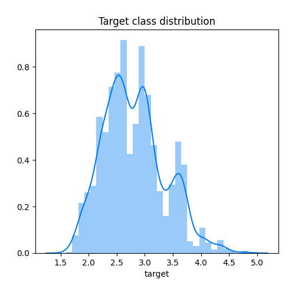
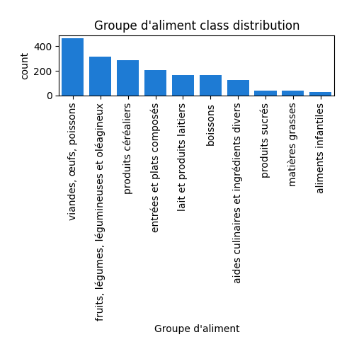
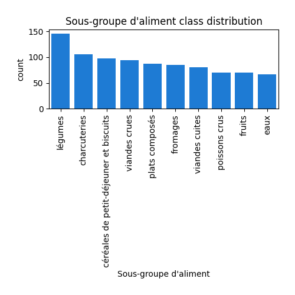
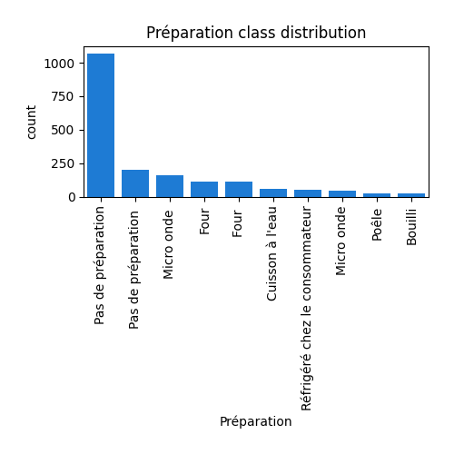

# Exploratory Data Analysis

[<< Go back](../README.md)
## Feature : target
- **Feature type** : continous
- **Missing** : 0.0%
- **Unique** : 214
- **Count** :1859.0
- **Mean** :2.8113286713286714
- **Std** :0.5395441295180835
- **Min** :1.6
- **25%th Percentile** : 2.43
- **50%th Percentile** : 2.77
- **75%th Percentile** : 3.11
- **Max** :4.83

## Feature : Code AGB
- **Feature type** : text
- **Missing** : 0.0%
- **Unique** : 1859
- **Count** :1859
- **Unique** :1859
- **Top** :24041
- **Freq** :1

## Feature : Code CIQUAL
- **Feature type** : discrete
- **Missing** : 0.0%
- **Unique** : 1856
- **Count** :1859.0
- **Mean** :22548.642280796128
- **Std** :14110.931795501925
- **Min** :1001.0
- **25%th Percentile** : 12762.5
- **50%th Percentile** : 20532.0
- **75%th Percentile** : 26108.5
- **Max** :96778.0

## Feature : Groupe d'aliment
- **Feature type** : categorical
- **Missing** : 0.0%
- **Unique** : 11
- **Count** :1859
- **Unique** :11
- **Top** :viandes, œufs, poissons
- **Freq** :464

## Feature : Sous-groupe d'aliment
- **Feature type** : categorical
- **Missing** : 0.0%
- **Unique** : 58
- **Count** :1859
- **Unique** :58
- **Top** :légumes
- **Freq** :146

## Feature : Nom du Produit en Français
- **Feature type** : text
- **Missing** : 0.0%
- **Unique** : 1859
- **Count** :1859
- **Unique** :1859
- **Top** :Poêlée de légumes assaisonnés à l'asiatiques ou wok de légumes, surgelée, crue
- **Freq** :1

## Feature : Saisonnalité
- **Feature type** : categorical
- **Missing** : 0.0%
- **Unique** : 3
- **Count** :1859
- **Unique** :3
- **Top** :mix de consommation FR
- **Freq** :1855

## Feature : Transport par avion (1 : par avion)
- **Feature type** : discrete
- **Missing** : 0.0%
- **Unique** : 2
- **Count** :1859.0
- **Mean** :0.0005379236148466917
- **Std** :0.02319318035213566
- **Min** :0.0
- **25%th Percentile** : 0.0
- **50%th Percentile** : 0.0
- **75%th Percentile** : 0.0
- **Max** :1.0

.png)
## Feature : Livraison
- **Feature type** : categorical
- **Missing** : 0.0%
- **Unique** : 5
- **Count** :1859
- **Unique** :5
- **Top** :Glacé
- **Freq** :1003

## Feature : Matériau d'emballage
- **Feature type** : categorical
- **Missing** : 0.0%
- **Unique** : 19
- **Count** :1859
- **Unique** :19
- **Top** :PS
- **Freq** :388

## Feature : Préparation
- **Feature type** : categorical
- **Missing** : 0.0%
- **Unique** : 11
- **Count** :1859
- **Unique** :11
- **Top** :Pas de préparation
- **Freq** :1072

## Feature : Score unique EF (mPt/kg de produit)
- **Feature type** : continous
- **Missing** : 0.0%
- **Unique** : 1024
- **Count** :1859.0
- **Mean** :0.7057219672389456
- **Std** :0.887612606302758
- **Min** :0.006130241099999999
- **25%th Percentile** : 0.16882872999999998
- **50%th Percentile** : 0.3796399
- **75%th Percentile** : 0.86286023
- **Max** :6.0857682

.png)
## Feature : Changement climatique (kg CO2 eq/kg de produit)
- **Feature type** : continous
- **Missing** : 0.0%
- **Unique** : 1024
- **Count** :1859.0
- **Mean** :5.886012626979021
- **Std** :9.216624735065963
- **Min** :0.021046612000000003
- **25%th Percentile** : 1.0807981
- **50%th Percentile** : 2.6346488999999997
- **75%th Percentile** : 6.3282902
- **Max** :62.729303

.png)
## Feature : Appauvrissement de la couche d'ozone (E-06 kg CVC11 eq/kg de produit)
- **Feature type** : continous
- **Missing** : 0.0%
- **Unique** : 1025
- **Count** :1859.0
- **Mean** :0.5998519789409361
- **Std** :5.6626198694896575
- **Min** :0.008919305800000001
- **25%th Percentile** : 0.16096224
- **50%th Percentile** : 0.25995514000000003
- **75%th Percentile** : 0.541807165
- **Max** :243.44932999999997

.png)
## Feature : Rayonnements ionisants (kBq U-235 eq/kg de produit)
- **Feature type** : continous
- **Missing** : 0.0%
- **Unique** : 1032
- **Count** :1859.0
- **Mean** :1.2430172204744485
- **Std** :1.9125493623046503
- **Min** :0.081033574
- **25%th Percentile** : 0.46878608499999996
- **50%th Percentile** : 0.8130866
- **75%th Percentile** : 1.3448674500000002
- **Max** :33.548897

.png)
## Feature : Formation photochimique d'ozone (E-03 kg NMVOC eq/kg de produit)
- **Feature type** : continous
- **Missing** : 0.0%
- **Unique** : 1025
- **Count** :1859.0
- **Mean** :21.15691655823023
- **Std** :42.12155943359328
- **Min** :0.061075725
- **25%th Percentile** : 3.6102189
- **50%th Percentile** : 7.733448200000001
- **75%th Percentile** : 18.3088395
- **Max** :328.58861

.png)
## Feature : Particules (E-06 disease inc./kg de produit)
- **Feature type** : continous
- **Missing** : 0.0%
- **Unique** : 1024
- **Count** :1859.0
- **Mean** :0.5710819007247983
- **Std** :0.8988995118386985
- **Min** :0.0014343386999999999
- **25%th Percentile** : 0.081238539
- **50%th Percentile** : 0.23722045
- **75%th Percentile** : 0.67341063
- **Max** :6.372366

.png)
## Feature : Acidification terrestre et eaux douces (mol H+ eq/kg de produit)
- **Feature type** : continous
- **Missing** : 0.0%
- **Unique** : 1025
- **Count** :1859.0
- **Mean** :0.0812363584923615
- **Std** :0.13327089737820072
- **Min** :0.00011195104999999999
- **25%th Percentile** : 0.00934169655
- **50%th Percentile** : 0.033239674
- **75%th Percentile** : 0.0878657225
- **Max** :0.94577275

.png)
## Feature : Eutrophisation terreste (mol N eq/kg de produit)
- **Feature type** : continous
- **Missing** : 0.0%
- **Unique** : 1024
- **Count** :1859.0
- **Mean** :0.31954935797394296
- **Std** :0.5626632336862011
- **Min** :0.00025722718
- **25%th Percentile** : 0.032433203
- **50%th Percentile** : 0.11768465
- **75%th Percentile** : 0.3165338
- **Max** :4.1982737

.png)
## Feature : Eutrophisation eaux douces (E-03 kg P eq/kg de produit)
- **Feature type** : continous
- **Missing** : 0.0%
- **Unique** : 1025
- **Count** :1859.0
- **Mean** :0.9696703415696611
- **Std** :2.409962558379105
- **Min** :0.0091508965
- **25%th Percentile** : 0.2306631
- **50%th Percentile** : 0.55363064
- **75%th Percentile** : 1.0704137
- **Max** :28.321094

.png)
## Feature : Eutrophisation marine (E-03 kg N eq/kg de produit)
- **Feature type** : continous
- **Missing** : 0.0%
- **Unique** : 1025
- **Count** :1859.0
- **Mean** :28.755172303655726
- **Std** :53.426861540242086
- **Min** :0.029340733
- **25%th Percentile** : 4.7734426999999995
- **50%th Percentile** : 13.003172
- **75%th Percentile** : 27.858909000000004
- **Max** :668.3395899999998

.png)
## Feature : Utilisation du sol (Pt/kg de produit)
- **Feature type** : continous
- **Missing** : 0.0%
- **Unique** : 1024
- **Count** :1859.0
- **Mean** :311.8029856509091
- **Std** :684.0258385947157
- **Min** :-125.33747
- **25%th Percentile** : 26.9771315
- **50%th Percentile** : 108.36556999999999
- **75%th Percentile** : 258.631395
- **Max** :5537.6867

.png)
## Feature : Écotoxicité pour écosystèmes aquatiques d'eau douce (CTUe/kg de produit)
- **Feature type** : continous
- **Missing** : 0.0%
- **Unique** : 1025
- **Count** :1859.0
- **Mean** :108.83220243824638
- **Std** :139.82876322593663
- **Min** :1.2468278999999998
- **25%th Percentile** : 31.5600065
- **50%th Percentile** : 71.09155600000001
- **75%th Percentile** : 134.9999
- **Max** :2956.2833

.png)
## Feature : Épuisement des ressources eau (m3 depriv./kg de produit)
- **Feature type** : continous
- **Missing** : 0.0%
- **Unique** : 1025
- **Count** :1859.0
- **Mean** :5.398164497908553
- **Std** :12.848502674289882
- **Min** :-15.066491000000001
- **25%th Percentile** : 1.1730795
- **50%th Percentile** : 2.6241868
- **75%th Percentile** : 5.5403847
- **Max** :274.33218999999997

.png)
## Feature : Épuisement des ressources énergétiques (MJ/kg de produit)
- **Feature type** : continous
- **Missing** : 0.0%
- **Unique** : 1024
- **Count** :1859.0
- **Mean** :53.291119500215174
- **Std** :56.8722164028646
- **Min** :2.0298265
- **25%th Percentile** : 23.224489
- **50%th Percentile** : 34.659384
- **75%th Percentile** : 62.860752000000005
- **Max** :752.4941200000001

.png)
## Feature : Épuisement des ressources minéraux (E-06 kg Sb eq/kg de produit)
- **Feature type** : continous
- **Missing** : 0.0%
- **Unique** : 1025
- **Count** :1859.0
- **Mean** :8.782622543270577
- **Std** :17.143827915758898
- **Min** :0.10825636
- **25%th Percentile** : 2.6424077500000003
- **50%th Percentile** : 5.0208833
- **75%th Percentile** : 10.082564
- **Max** :258.65773

.png)

[<< Go back](../README.md)
