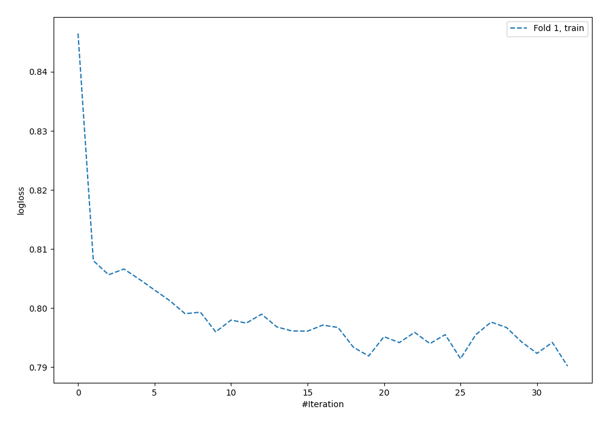
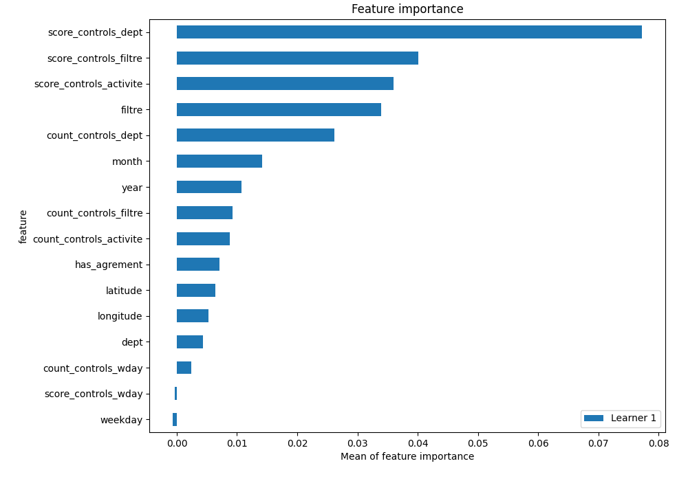

# Summary of 5_Default_NeuralNetwork

[<< Go back](../README.md)

## Neural Network
- **dense_1_size**: 32
- **dense_2_size**: 16
- **learning_rate**: 0.05
- **num_class**: 4
- **explain_level**: 2

## Validation
 - **validation_type**: split
 - **train_ratio**: 0.75
 - **shuffle**: True
 - **stratify**: True

## Optimized metric
logloss

## Training time

3.3 seconds

### Metric details
|           |   0 |   1 |           2 |           3 |   accuracy |   macro avg |   weighted avg |   logloss |
|:----------|----:|----:|------------:|------------:|-----------:|------------:|---------------:|----------:|
| precision |   0 |   0 |    0.618693 |    0.62597  |   0.621992 |    0.311166 |       0.587478 |  0.802565 |
| recall    |   0 |   0 |    0.681208 |    0.633733 |   0.621992 |    0.328735 |       0.621992 |  0.802565 |
| f1-score  |   0 |   0 |    0.648447 |    0.629827 |   0.621992 |    0.319569 |       0.603978 |  0.802565 |
| support   | 282 |  19 | 2682        | 2419        |   0.621992 | 5402        |    5402        |  0.802565 |

## Confusion matrix
|              |   Predicted as 0 |   Predicted as 1 |   Predicted as 2 |   Predicted as 3 |
|:-------------|-----------------:|-----------------:|-----------------:|-----------------:|
| Labeled as 0 |                0 |                0 |              225 |               57 |
| Labeled as 1 |                0 |                0 |               15 |                4 |
| Labeled as 2 |                0 |                0 |             1827 |              855 |
| Labeled as 3 |                0 |                0 |              886 |             1533 |

## Learning curves

## Permutation-based Importance

[<< Go back](../README.md)
