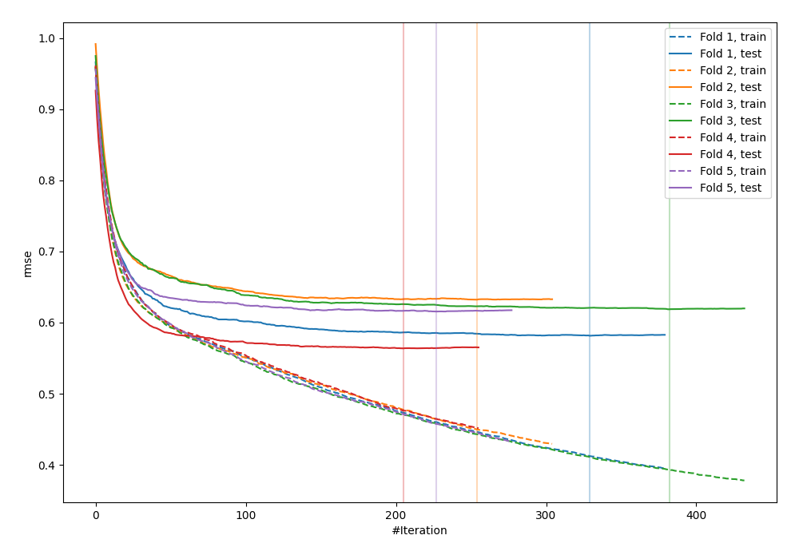
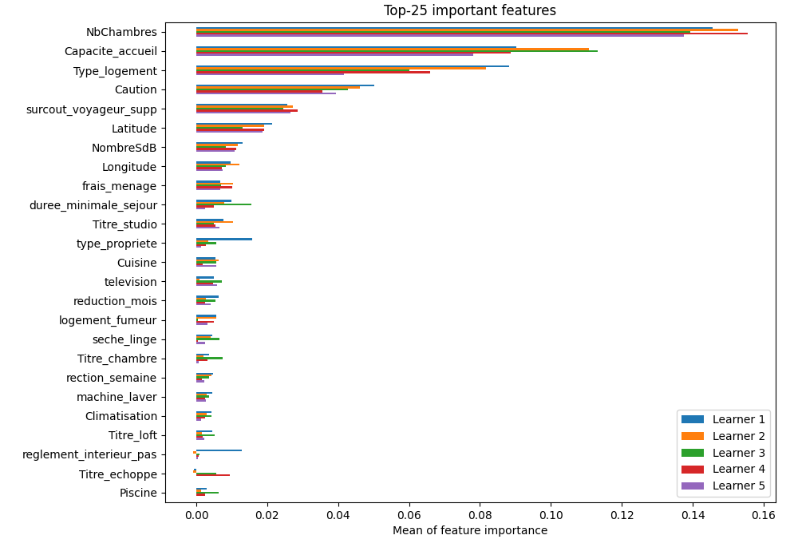

# Summary of 4_Default_CatBoost

[<< Go back](../README.md)

## CatBoost
- **learning_rate**: 0.1
- **depth**: 6
- **rsm**: 1
- **loss_function**: RMSE
- **explain_level**: 1

## Validation
 - **validation_type**: kfold
 - **k_folds**: 5
 - **shuffle**: True

## Optimized metric
rmse

## Training time

55.4 seconds

### Metric details:
| Metric   |       Score |
|:---------|------------:|
| MAE      |   20.8264   |
| MSE      | 1731.5      |
| RMSE     |   41.6113   |
| R2       |    0.558429 |

## Learning curves

## Permutation-based Importance

[<< Go back](../README.md)
