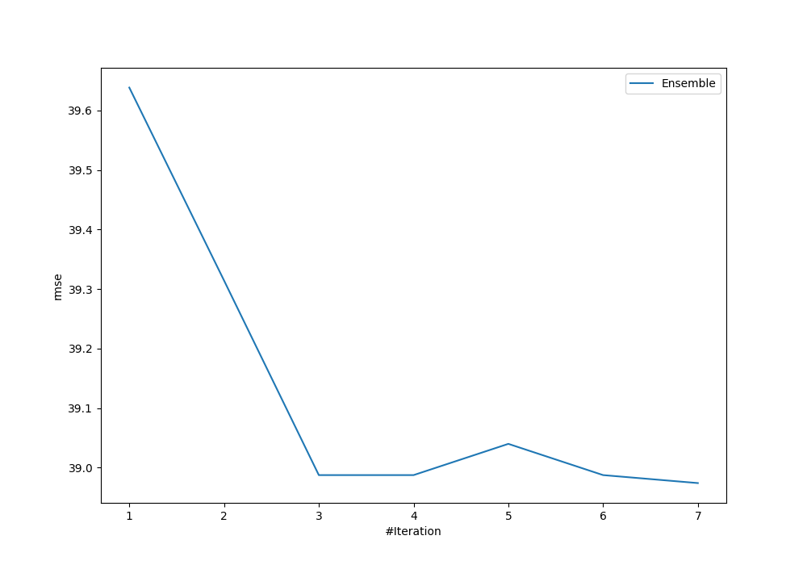

# Summary of Ensemble

[<< Go back](../README.md)

## Ensemble structure
| Model             |   Weight |
|:------------------|---------:|
| 3_Linear          |        5 |
| 4_Default_Xgboost |        2 |

### Metric details:
| Metric   |       Score |
|:---------|------------:|
| MAE      |   21.0753   |
| MSE      | 1518.97     |
| RMSE     |   38.974    |
| R2       |    0.646404 |

## Learning curves

[<< Go back](../README.md)
