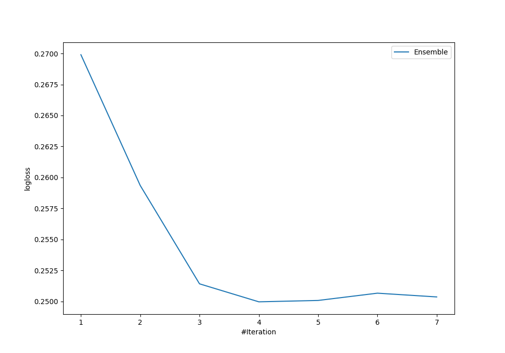

# Summary of Ensemble

[<< Go back](../README.md)

## Ensemble structure
| Model                   |   Weight |
|:------------------------|---------:|
| 4_Default_Xgboost       |        3 |
| 5_Default_NeuralNetwork |        1 |

### Metric details
|           |        C1 |        C2 |       C3 |       C4 |   C5 |      nan |   accuracy |   macro avg |   weighted avg |   logloss |
|:----------|----------:|----------:|---------:|---------:|-----:|---------:|-----------:|------------:|---------------:|----------:|
| precision |  0.904762 |  0.901235 | 1        | 0.833333 |    1 | 0.833333 |   0.901408 |    0.912111 |       0.905867 |  0.249979 |
| recall    |  0.883721 |  0.948052 | 0.285714 | 1        |    1 | 1        |   0.901408 |    0.852915 |       0.901408 |  0.249979 |
| f1-score  |  0.894118 |  0.924051 | 0.444444 | 0.909091 |    1 | 0.909091 |   0.901408 |    0.846799 |       0.892965 |  0.249979 |
| support   | 43        | 77        | 7        | 5        |    5 | 5        |   0.901408 |  142        |     142        |  0.249979 |

## Confusion matrix
|                |   Predicted as C1 |   Predicted as C2 |   Predicted as C3 |   Predicted as C4 |   Predicted as C5 |   Predicted as nan |
|:---------------|------------------:|------------------:|------------------:|------------------:|------------------:|-------------------:|
| Labeled as C1  |                38 |                 5 |                 0 |                 0 |                 0 |                  0 |
| Labeled as C2  |                 4 |                73 |                 0 |                 0 |                 0 |                  0 |
| Labeled as C3  |                 0 |                 3 |                 2 |                 1 |                 0 |                  1 |
| Labeled as C4  |                 0 |                 0 |                 0 |                 5 |                 0 |                  0 |
| Labeled as C5  |                 0 |                 0 |                 0 |                 0 |                 5 |                  0 |
| Labeled as nan |                 0 |                 0 |                 0 |                 0 |                 0 |                  5 |

## Learning curves

[<< Go back](../README.md)
